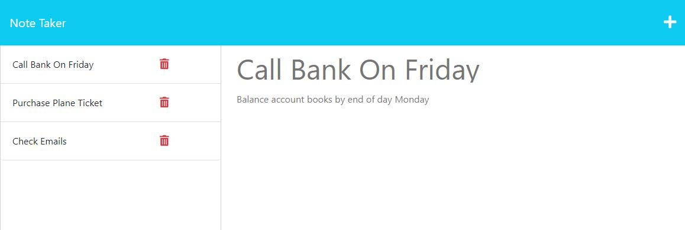

# Express Note Taker 

## Description:

this application, the backend is using the Express framework for Node.js, and the frontend is using vanilla JavaScript to interact with the server via RESTful APIs. The Note Taker application allows users to create, save, and view notes. Overall, the Note Taker application provides users with a simple and intuitive way to take and organize notes.

## Skills Used

- JavaScript programming
- Node.js and Express.js
- Asynchronous programming using promises and callbacks
- Client-server architecture and RESTful API design
- JSON data format
- Reading and writing data to/from files using Node.js
- Parsing JSON data in Node.js and in the browser
- HTML and CSS
- DOM manipulation using JavaScript
- Event handling in JavaScript
- Fetch API for making HTTP requests in the browser
- Debugging and troubleshooting web applications

## User Story

AS A small business owner
I WANT to be able to write and save notes
SO THAT I can organize my thoughts and keep track of tasks I need to complete

## Table of Contents:

- [Installation](#installation)
- [Usage](#usage)
- [Tests](#tests)
- [Badges](#badges)
- [How_to_Contribute](#how_to_contribute)
- [Questions](#questions)
- [License](#license)

## Installation:

&nbsp; none

## Usage:

&nbsp;When the application is opened, users are presented with a landing page that provides a link to the notes page. Clicking on this link takes users to a page where existing notes are listed in the left-hand column, while the right-hand column contains empty fields to enter a new note title and text. As soon as a user starts entering a new note, a Save icon appears in the navigation at the top of the page. Clicking on this icon saves the new note, which then appears in the left-hand column alongside existing notes. Clicking on an existing note in the left-hand column displays it in the right-hand column, allowing users to view and edit its content. Finally, clicking on the Write icon in the navigation at the top of the page presents users with empty fields to enter a new note title and text in the right-hand column.

&nbsp; The repo can be found at: https://github.com/arishorts/expressNoteTaker  
&nbsp; The website can be found at: https://arishorts-express-note-taker.herokuapp.com/notes

## Tests:

&nbsp; none

## Badges:

## How_to_Contribute:

&nbsp; If you would like to contribute, refer to the [Contributor Covenant](https://www.contributor-covenant.org/)

## Questions:

&nbsp; My GitHub profile can be found at: https://github.com/arishorts
 &nbsp; Reach me with additional questions at : arieljschwartz@gmail.com

## License:

&nbsp; http://choosealicense.com/licenses/mit/

---

© 2022 Ariel Schwartz LLC. Confidential and Proprietary. All Rights Reserved.
